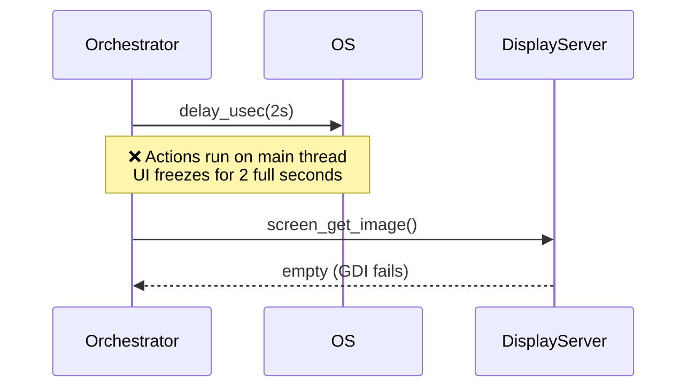
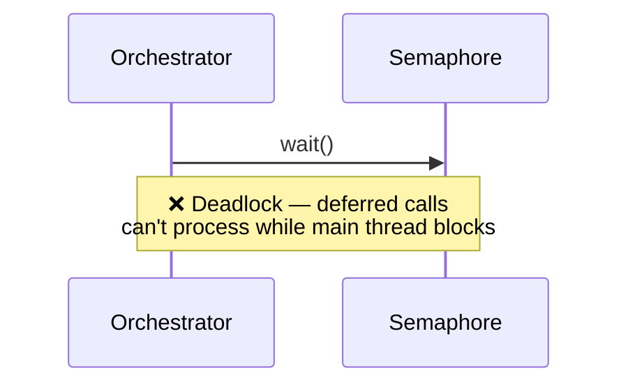
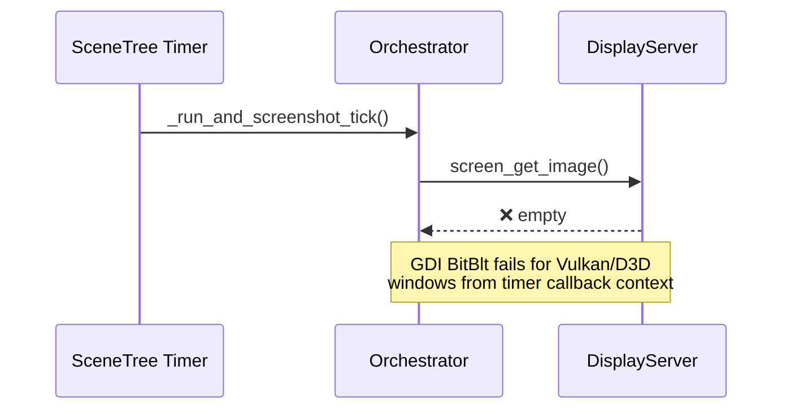
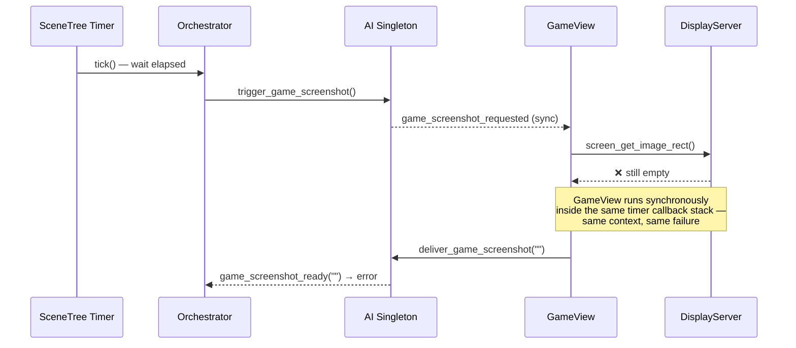
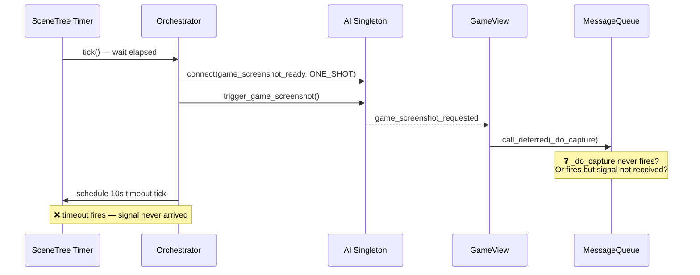

# run_and_screenshot: Capture Approaches Tried

## Approach 1: `delay_usec` + `screen_get_image` on action thread

Actions run on the **main thread** (via `call_deferred`), so `delay_usec` locks the entire editor.

---

## Approach 2: Semaphore + dispatched capture

`Semaphore::wait()` on the main thread prevents any deferred call from ever flushing — instant deadlock.

---

## Approach 3: SceneTree timer → `screen_get_image` from orchestrator

Non-blocking ✓, but `screen_get_image()` returns empty from within a SceneTree timer callback on Windows — GDI can't composite hardware-accelerated windows in that context.

---

## Approach 4: Signal → GameView (synchronous capture)

Routed through GameView's proven capture code, but the synchronous signal call still runs inside the timer callback's call stack — same context problem.

---

## Approach 5: Signal → GameView → `call_deferred` (current)

`call_deferred` should push `_do_ai_screenshot_capture` out of the timer context into the message queue flush phase. But debug logs show `_on_ai_screenshot_requested` **never even fires** — meaning GameView was never connected to `game_screenshot_requested`, or the connection was lost.

---

**Next step:** debug build prints `AI_DBG: NOTIFICATION_READY in GameView` at editor startup to confirm whether the signal connection is ever made.
